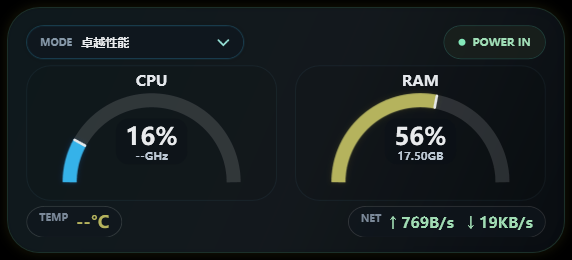
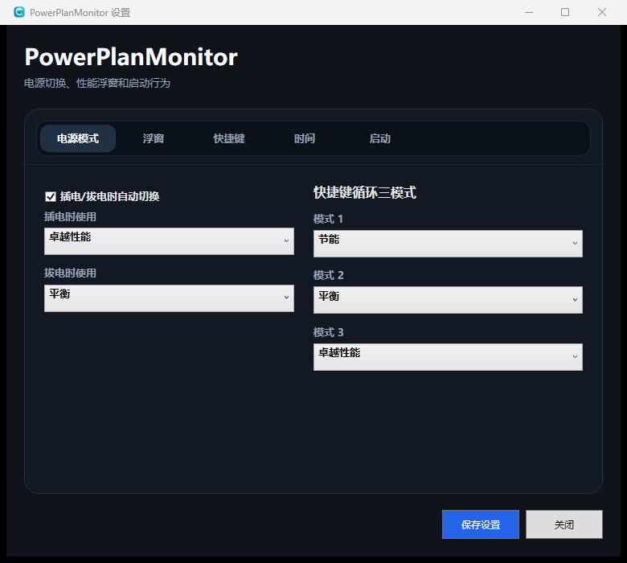

# PowerPlanMonitor

PowerPlanMonitor 是一个使用 `.NET 8 + WPF` 开发的 Windows 电源计划切换与系统状态监控工具。它常驻系统托盘，通过低干扰的桌面悬浮仪表盘展示 CPU、内存、温度和实时网速，并提供插拔电自动切换、自定义全局快捷键与开机启动能力。



## 功能

- 在托盘菜单或悬浮窗中查看并切换 Windows 电源计划。
- 插入电源和使用电池时，自动切换到分别设定的电源模式。
- 自定义全局快捷键，在三个常用电源模式之间循环切换。
- 实时显示 CPU 使用率、当前频率、CPU 温度、内存使用率、剩余内存，以及网络上传和下载速度。
- 悬浮窗支持缩放、透明度、置顶、自动贴边和隐藏。
- 切换模式后显示简洁的 OSD 提示。
- 支持 Windows 登录后自动启动。
- 可在任务栏托盘区域显示指定时区的双行时间和日期。
- 可选使用 PawnIO 驱动读取支持设备的 CPU 温度。

## 设置

所有常用选项均可通过图形界面配置，包括电源模式、悬浮窗、快捷键、托盘时钟和开机启动。



配置默认保存到：

```text
%APPDATA%\PowerPlanMonitor\setting.ini
```

## 下载与安装

在 [Releases](https://github.com/deepinfxxkzzpzr/PowerPlanMonitor/releases) 页面下载最新的 MSI 安装包。当前版本为 [`v1.0.24`](https://github.com/deepinfxxkzzpzr/PowerPlanMonitor/releases/tag/v1.0.24)。

安装包会把程序安装到 `C:\Program Files\PowerPlanMonitor`，并注册 Windows 登录计划任务。CPU 温度驱动属于可选功能，需要时可从托盘菜单或设置窗口安装。

## 系统要求

- Windows 10 1809 或更高版本
- 64 位 Windows（`win-x64`）
- 切换电源计划和安装硬件温度驱动时需要相应的系统权限
- CPU 温度是否可读取取决于处理器、主板和驱动支持；不可用时界面显示 `--°C`

## 从源码构建

需要 Windows 和 .NET 8 SDK：

```powershell
dotnet restore PowerPlanMonitorApp/PowerPlanMonitor.App/PowerPlanMonitor.App.csproj
dotnet build PowerPlanMonitorApp/PowerPlanMonitor.App/PowerPlanMonitor.App.csproj -c Release
```

发布自包含的单文件程序：

```powershell
dotnet publish PowerPlanMonitorApp/PowerPlanMonitor.App/PowerPlanMonitor.App.csproj `
  -c Release -r win-x64 --self-contained true `
  -p:PublishSingleFile=true `
  -p:IncludeNativeLibrariesForSelfExtract=true
```

安装包使用 WiX Toolset 5 构建，定义文件位于 `PowerPlanMonitorApp/Installer/Product.wxs`。

`PawnIO_Setup.exe` 是可选的第三方发布依赖，不提交到源码仓库。需要在发布包中提供驱动安装功能时，请自行取得受信任版本，并放入 `PowerPlanMonitorApp/ThirdParty/` 后再执行发布。

## 项目结构

```text
PowerPlanMonitorApp/
├── PowerPlanMonitor.App/          WPF 主程序
│   ├── Models/                    配置、电源计划和监控数据模型
│   ├── Services/                  电源、指标、温度、快捷键和启动服务
│   └── *.xaml                     悬浮窗、设置页、托盘时钟和 OSD 界面
├── PowerPlanMonitor.Diagnostics/  硬件传感器诊断工具
└── Installer/                     WiX MSI 安装包定义
```

## 第三方组件

- [LibreHardwareMonitor](https://github.com/LibreHardwareMonitor/LibreHardwareMonitor)：硬件传感器读取
- [PawnIO](https://github.com/namazso/PawnIO)：可选的底层硬件访问驱动
- [System.Management](https://www.nuget.org/packages/System.Management)：Windows 管理信息访问

## 许可证

本项目采用 [MIT License](LICENSE) 开源。
